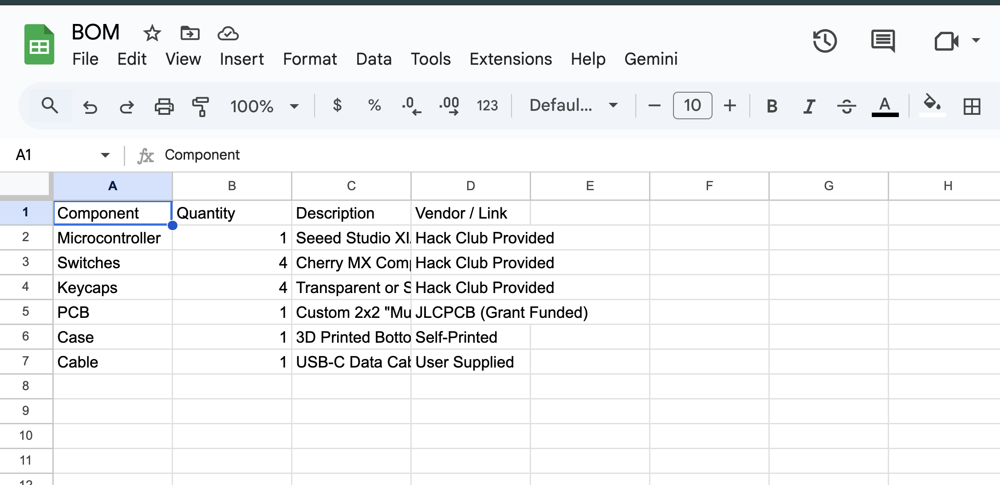
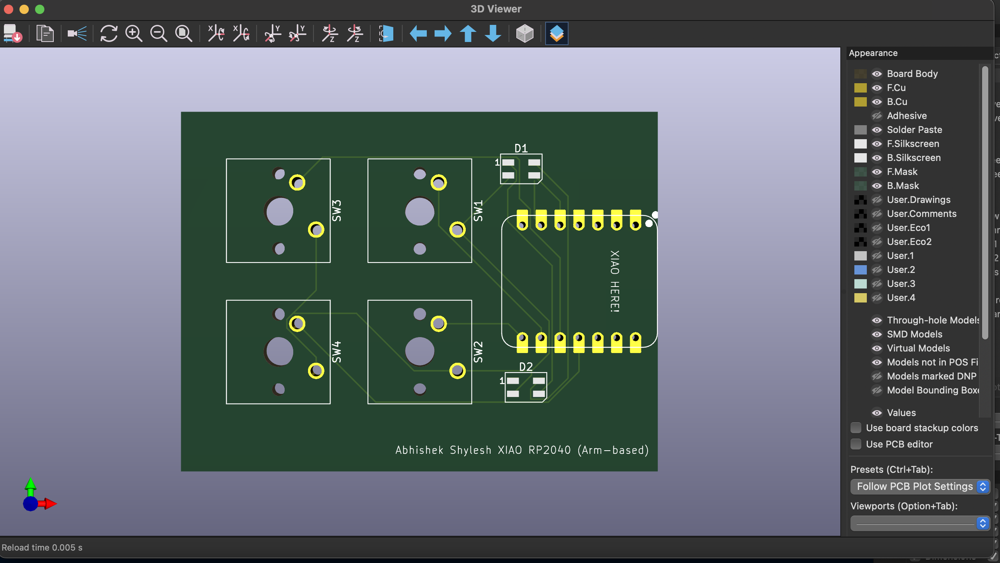
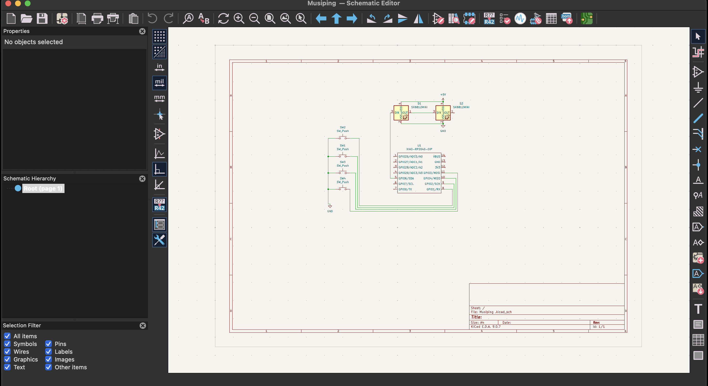
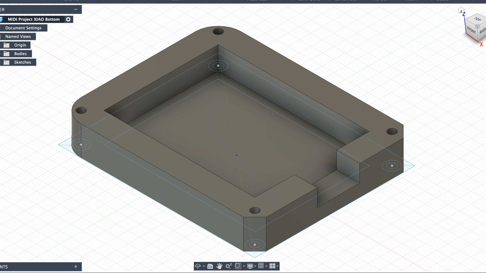
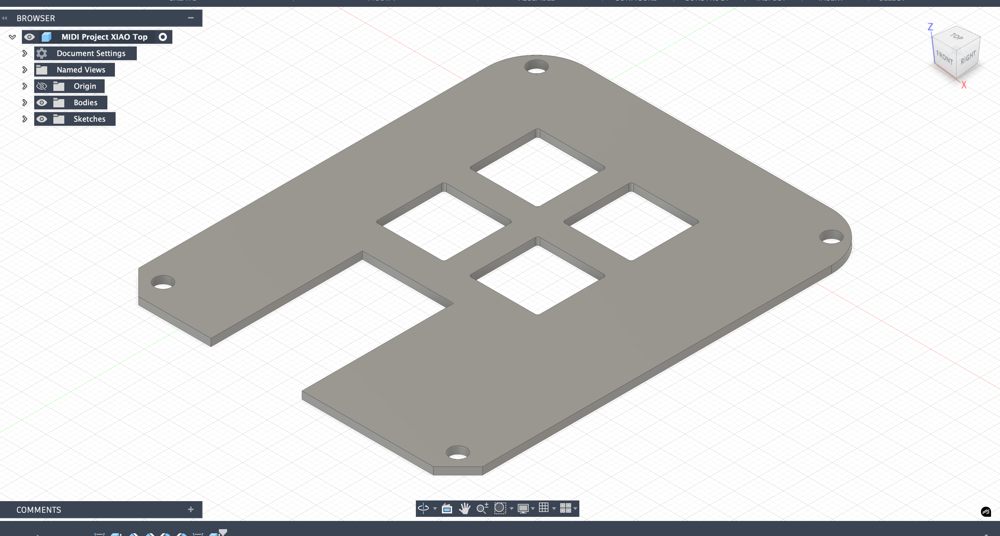

# MIDI-Music-Controller-Musiping-

MIDI Music Controller ("Musiping")

A custom 2x2 MIDI Macropad designed specifically for music production, powered by the Seeed XIAO RP2040.

Project Concept & Variation
While this project follows the standard "Macropad" starter track, it differs in **firmware** and **hardware design intent**.
1) **Standard Macropad:** Types letters (A, B, C) for shortcuts.
2) **Musiping:** Functions as a **MIDI Instrument**. It sends musical notes (C4, D4, E4, F4) to Digital Audio Workstations (DAW) like Ableton Live or FL Studio. It is designed to be a "drum pad" or "sample trigger" rather than a typing keypad.

Features
1) **Microcontroller:** Seeed Studio XIAO RP2040 (ARM-based).
2) **Switch Layout:** 2x2 Grid (4 Mechanical Switches).
3) **Case Design:** **Low-Profile Tray Mount**. This design intentionally omits a top lid; the PCB sits inside a bottom tray, and the switches "float" for an exposed industrial aesthetic.
4) **Firmware:** Custom CircuitPython/KMK script configured for MIDI communication.

📋 Bill of Materials (BOM)

📸 Design Visuals

PCB 3D Render

Schematic

Case Design (Bottom and Top)

-------------------------------
*Designed by Abhishek Shylesh for the Hack Club Blueprint project.
